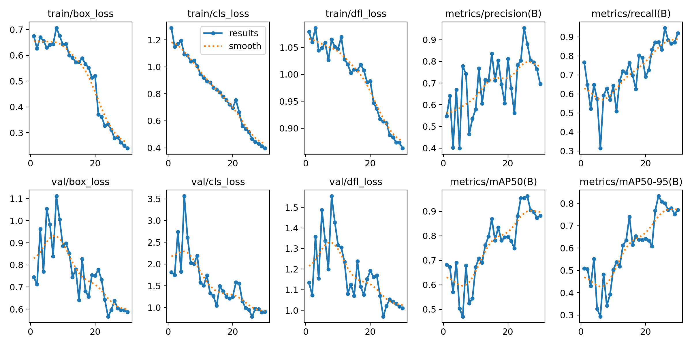
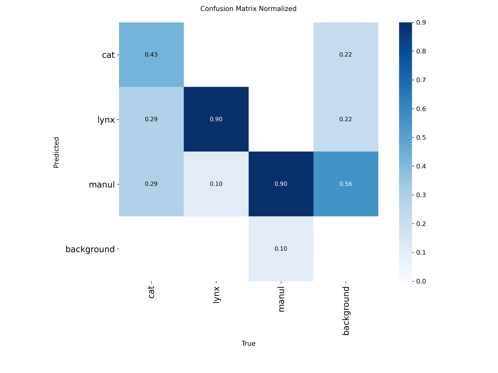
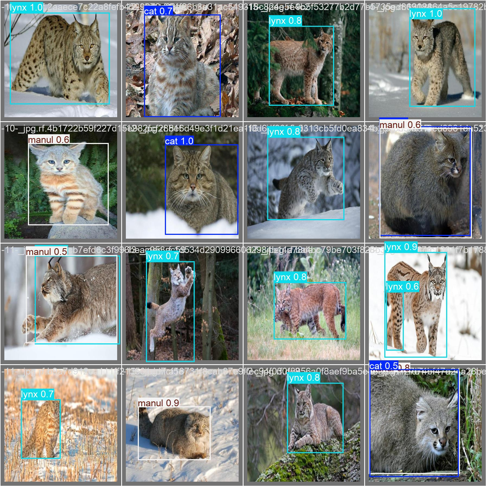

# Manul Detector 🐱

Учебный проект в рамках **проектной практики**, посвящённый применению методов компьютерного зрения для
распознавания редкого вида животного — **манула**, а также для его визуального отличия от других диких кошачьих (диких кошек и рысей) - на изображениях дикой природы .

Проект демонстрирует полный цикл работы с моделью детекции объектов:
от подготовки датасета до обучения и анализа результатов.

---

## Цель проекта

Целью проекта является проверка возможности использования нейросетевой модели **YOLOv8**
для автоматического обнаружения манула на изображениях из дикой природы.

Проект ориентирован на практическое освоение инструментов машинного обучения
и не предполагает достижения промышленных или научных результатов.

---

## Задачи проекта

В рамках проектной практики были поставлены следующие задачи:

* собрать и подготовить датасет изображений манула
* разметить данные в формате YOLO
* применить аугментацию для увеличения объёма выборки
* обучить модель YOLOv8 на подготовленных данных
* оценить качество работы модели на тестовых изображениях
* проанализировать полученные результаты

---

## Используемые технологии

* Python 3
* Ultralytics YOLOv8
* Jupyter Notebook
* Roboflow (для разметки и аугментации)

---

## Датасет

Исходный датасет содержал около **130 изображений манула, рыси и дикой кошки**.
Для повышения устойчивости модели были применены методы аугментации
(повороты, отражение, изменение яркости), в результате чего
общий объём данных был увеличен примерно до **320 изображений**.

Датасет разделён на три части:

* `train` — обучающая выборка
* `valid` — валидационная выборка
* `test` — тестовая выборка

Структура датасета соответствует формату YOLO.

---

## Обучение модели

Для обучения использовалась предобученная модель **YOLOv8**,
которая была дообучена на собранном датасете манула.

В процессе обучения сохранялись:

* значения precision, recall и mAP
* графики обучения
* матрица ошибок (confusion matrix)

### Результаты

### Матрица ошибок

Все результаты обучения находятся в директории `result_data/`.

---

## Результаты

Модель показала способность корректно обнаруживать манула
на изображениях дикой природы.

При этом качество распознавания зависит от:

* ракурса съёмки
* освещения
* степени перекрытия объекта
* визуального сходства манула с другими кошачьими

Полученные результаты являются удовлетворительными
для учебного проекта в рамках проектной практики.

### Обнаружение манула

---

## Ограничения проекта

* небольшой объём исходного датасета
* ограниченное разнообразие условий съёмки
* отсутствие дообучения на данных фотоловушек

Данные ограничения не позволяют рассматривать модель
как готовое прикладное решение, однако они допустимы
в рамках учебной задачи.

---

## Заключение

В ходе проектной практики была реализована система детекции манула
на основе нейросетевой модели YOLOv8.

Проект позволил на практике изучить этапы работы с данными,
обучения модели и анализа результатов,
а также показал применимость методов компьютерного зрения
для задач мониторинга редких видов животных.