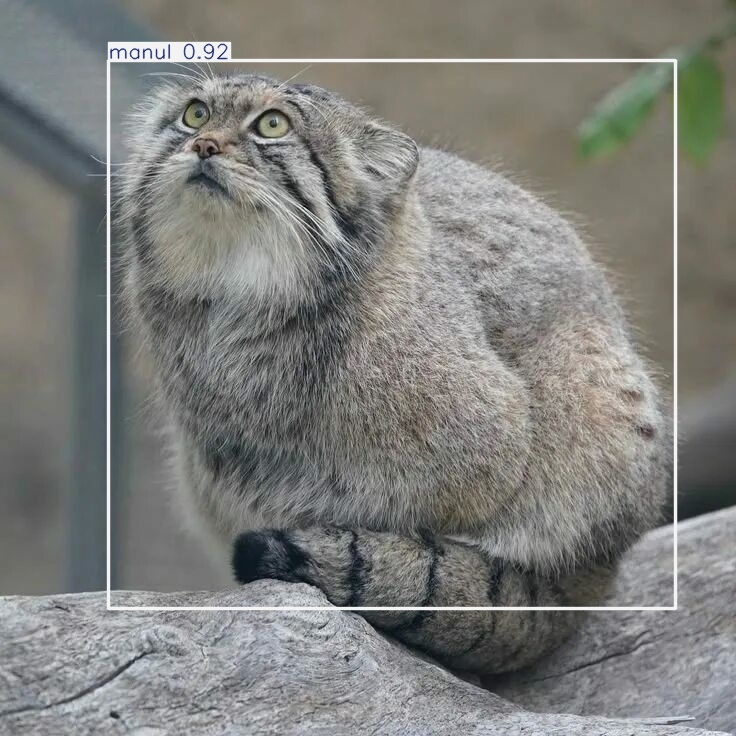
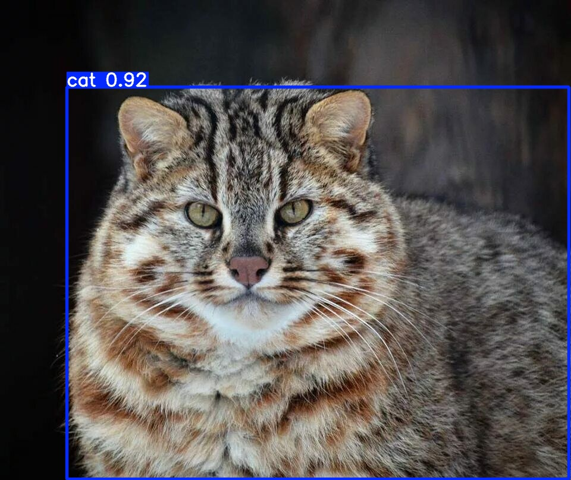

# Manul Detector: Детекция манулов с помощью YOLOv8

**Проект по компьютерному зрению для автоматического мониторинга популяции манулов - редкого вида, занесённого в Красную книгу России.**

Модель дообучена не только для детекции манулов, но и для их визуального отличия от других диких кошачьих (диких кошек и рысей), что снижает количество ложных срабатываний в полевых условиях.

---

## 🎯 Суть проекта

Манул - редкий и скрытный вид, мониторинг которого традиционными методами сложен и трудоёмок. Данный проект использует современные методы компьютерного зрения (дообученную модель YOLOv8) для автоматической детекции манулов на фотоматериалах с фотоловушек. Главная особенность — модель способна **отличать манула от других похожих хищников** (обычных диких кошек и рысей), что критически важно для точного учёта.

**Цель**: Создать открытый, точный и простой в использовании инструмент для экологов и зоозащитников, способный ускорить и удешевить процесс сбора данных о популяции манулов.

---

## ✨ Ключевые возможности

*   **Высокоточная детекция манулов**: Специализированная модель, настроенная на характерные признаки манула (особенности окраса, телосложение, "плоская" морда).
*   **Дифференциация видов**: Отличия манула от классов `cat` (дикая кошка) и `lynx` (рысь) для минимизации ошибок.
*   **Готовность к работе**: Модель доступна для скачивания и может быть запущена на обычном компьютере с GPU или даже CPU.
*   **Простота интеграции**: Предоставлены примеры кода для быстрого внедрения в pipelines обработки изображений с фотоловушек.

---

## 📸 Демонстрация работы

